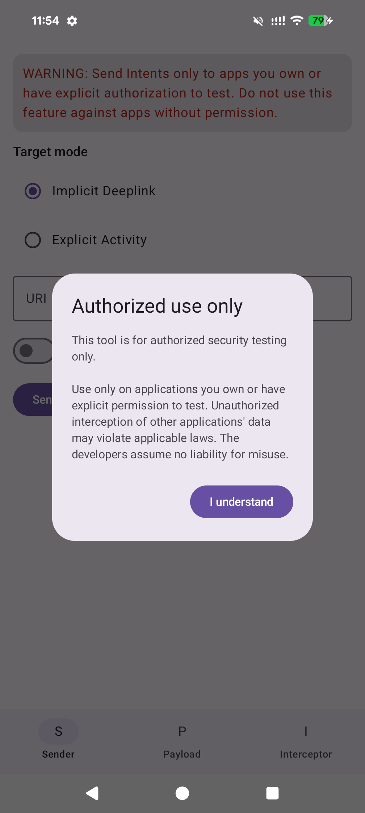
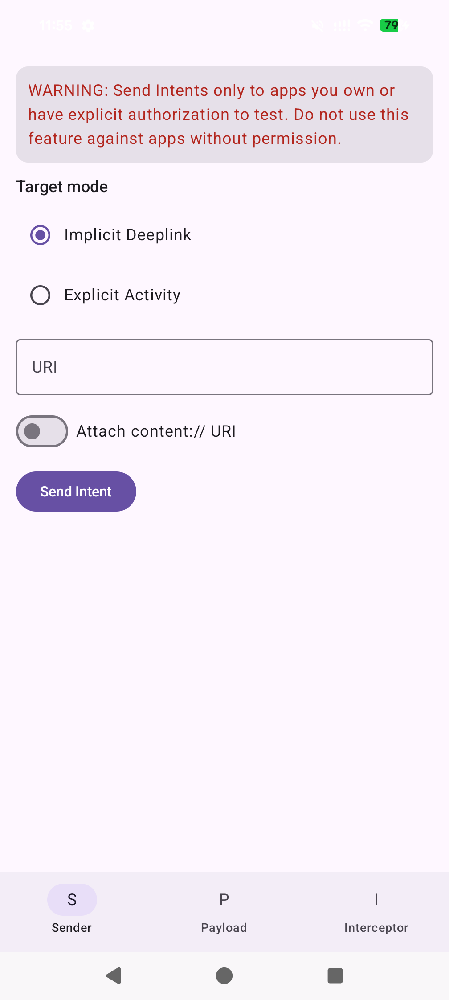
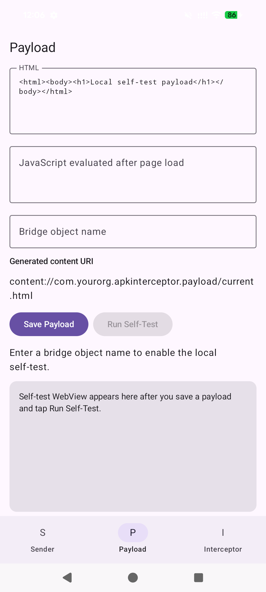
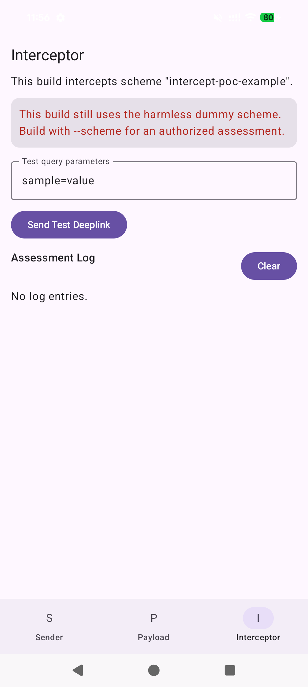

# apk-interceptor

**Android deeplink, Intent, and WebView bridge assessment helper**

apk-interceptor is a portable Android testing APK for authorized application
security assessments. It helps security engineers verify how an Android app
handles external entry points such as custom URI schemes, deeplinks, exported
Activities, and WebView JavaScript bridges.

The tool is intentionally constrained:

- It does not declare `android.permission.INTERNET`
- It does not send data to external servers
- It does not execute shell commands
- It does not require root, Magisk, Frida, or runtime instrumentation
- It serves only one local `content://` payload file
- It registers one custom URI scheme fixed at build time

## Authorized Use Only

Use this tool only for applications you own, applications you are contracted to
assess, internal training environments, and security labs. Do not use it
against third-party applications without explicit authorization.

## What You Can Test

apk-interceptor is useful for these assessment tasks:

| Scenario | Module | What It Helps Verify |
| --- | --- | --- |
| Custom URI scheme hijacking | Interceptor | Whether another app can register the same custom scheme and receive links |
| Deeplink parameter handling | Sender | Whether the assessed app accepts unsafe query/path parameters |
| Exported Activity exposure | Sender | Whether an exported Activity can be launched directly by another app |
| WebView bridge exposure via `content://` | Payload + Sender | Whether a local HTML payload can reach a WebView JavaScript bridge |
| Local payload syntax check | Payload | Whether your HTML/JS payload runs in the self-test WebView |

The app keeps an in-memory assessment log for sent Intents, received deeplinks,
bridge callbacks, JavaScript results, and errors. Logs disappear when the app
process is killed. Because logs are not persisted, capture evidence with
screenshots or screen recording as you work.

## How It Compares

apk-interceptor is a **confirmation** tool, not a discovery or exploitation
framework. It assumes you already know what to test (scheme, Activity class,
bridge name) from static analysis, and gives you a safe, on-device way to verify
reachability and capture evidence. It is built to be installed on an assessment
device and even shared with a client, so it ships no INTERNET permission, no
shell execution, no data exfiltration, and no root requirement.

Where it sits next to the usual Android tooling:

| Tool | Role | How apk-interceptor differs |
| --- | --- | --- |
| jadx / MobSF / QARK / Semgrep | Find vulnerable entry points (static) | apk-interceptor does not scan or decompile; it confirms a finding you already have |
| deep-C / NSdeepLink / `adb am start` | Enumerate and *send* deeplinks | apk-interceptor can also send, but its differentiator is *receiving* a hijacked scheme and showing the exact URI and parameters |
| drozer | General on-device attack framework (agent + often root) | apk-interceptor is a single lightweight APK with deliberate safety guardrails, narrower scope, and easier client-safe distribution |
| Metasploit / Frida | Weaponize or hook (e.g. `addJavascriptInterface` RCE) | apk-interceptor only checks bridge *reachability* with a harmless payload; it never exfiltrates or executes shell commands |

The two areas where apk-interceptor has the clearest edge over the alternatives:

- **Scheme-hijack evidence** — acting as the second app that actually registers
  the scheme and logging every received parameter, which `adb`/static analysis
  cannot show.
- **`content://` → WebView bridge verification** — a non-exported, single-file
  provider whose payload is delivered only through a temporary Intent read grant,
  plus a local self-test WebView to validate payload syntax first.

## Sending Versus Intercepting

apk-interceptor treats *sending* and *intercepting* differently, and this is the
most important thing to understand before using it:

| Action | Module | Custom scheme needed at build time? |
| --- | --- | --- |
| **Send** an Intent or deeplink to another app | Sender | No — type any URI, package, or Activity at runtime |
| **Intercept** (receive) a deeplink for a custom scheme | Interceptor | Yes — the scheme is fixed into the APK at build time |

To *send* a crafted deeplink to the assessed app, you do not need to rebuild:
use the Sender tab's **Implicit Deeplink** mode and type any URI.

To *intercept* a deeplink — that is, to make Android route a custom scheme to
apk-interceptor so you can observe a possible scheme-hijack — you must build the
APK with that scheme via `--scheme`. The scheme is fixed at build time on
purpose (a design guardrail); apk-interceptor never registers arbitrary schemes
at runtime. If you change the scheme you are assessing, rebuild and reinstall.

## Requirements

- Android Studio with Android SDK 35
- Android 12+ device or emulator
- JDK 17+
- `adb` for device installation and optional command-line testing

## Build And Install

Build the APK with the custom URI scheme you are authorized to assess:

```bash
./build-interceptor.sh --scheme <authorized_custom_scheme>
adb install ./out/apk-interceptor-<authorized_custom_scheme>-debug.apk
```

Optional build flags:

```bash
./build-interceptor.sh \
  --scheme <authorized_custom_scheme> \
  --app-id <custom.application.id> \
  --output ./out
```

`--app-id` sets the installed application ID (the package identity on the
device and the `content://<applicationId>.payload` authority) at build time.
The default is `com.sterrasec.apkinterceptor`. Override it with `--app-id` when
you need multiple separately installable builds for different assessments. The
Windows equivalent is `build-interceptor.bat`.

The default scheme `intercept-poc-example` is a harmless placeholder. The build
script refuses to produce an assessment APK with that default scheme.

## First Launch

On first launch for each app version, apk-interceptor shows an authorized-use
dialog. After you tap **I understand**, the same version does not show the
dialog again.
The Sender tab still shows a persistent warning because it can send Intents to
other apps.



## Screenshots

| Sender | Payload | Interceptor |
| --- | --- | --- |
|  |  |  |

## App Modules

### Interceptor

Use this tab to verify custom URI scheme interception.

What it shows:

- The scheme compiled into this APK
- A warning if the dummy default scheme is still in use
- Received deeplink logs
- A test query parameter field
- **Send Test Deeplink**
- **Clear**

Basic workflow:

1. Build the APK with the assessed custom scheme.
2. Install it alongside the assessed app.
3. Trigger a deeplink for that scheme from the assessed flow, browser, adb, or
   the built-in **Send Test Deeplink** button.
4. If Android routes the link to apk-interceptor, open the Interceptor tab and
   review the received URI and query parameters.

About **Send Test Deeplink**: it always sends `<scheme>://test?<your params>`
with a fixed `test` host, so it is meant for confirming that apk-interceptor
receives and logs the scheme — not for driving the assessed app's specific
deeplink routes. To send a crafted deeplink that matches the assessed app's
required host or path, use the Sender tab's **Implicit Deeplink** mode instead.

adb example:

```bash
adb shell am start -W \
  -a android.intent.action.VIEW \
  -d 'my-authorized-scheme://test?source=adb\&message=hello%20world'
```

Use `\&` when sending multiple query parameters through `adb shell`; otherwise
the device shell may treat `&` as a command separator.

Expected result:

- apk-interceptor opens to the Interceptor tab
- A `RECEIVED` log entry appears
- Tapping the log entry expands the full URI and parameter list

### Sender

Use this tab to send controlled Intents during an authorized test.

Modes:

- **Implicit Deeplink**: sends `Intent(ACTION_VIEW, Uri.parse(uri))`
- **Explicit Activity**: sends an Intent to a specific package and Activity
  class

Fields and controls:

- **URI** for implicit deeplink mode
- **Package name** for explicit Activity mode
- **Activity class** for explicit Activity mode
- **Attach content:// URI** to set the local payload URI as Intent data
  (shown in **Explicit Activity** mode only — see note below)
- **FLAG_GRANT_READ_URI_PERMISSION** to grant read access to the attached
  payload URI
- **Send Intent**

Implicit deeplink workflow:

1. Select **Implicit Deeplink**.
2. Enter a URI that matches the assessed app's deeplink pattern.
3. Tap **Send Intent**.
4. Observe the assessed app behavior and the apk-interceptor log.

Explicit Activity workflow:

1. Confirm the target Activity is exported and covered by your authorization.
2. Select **Explicit Activity**.
3. Enter the assessed app's package name.
4. Enter the exported Activity class name.
5. Optionally enable **Attach content:// URI**.
6. Tap **Send Intent**.

Notes:

- apk-interceptor does not know whether the assessed app handled the Intent
  safely. You must observe the assessed app behavior, logs, or test harness.
- The `content://` attachment is useful when testing whether a target Activity
  passes untrusted Intent data to a WebView.
- **Attach content:// URI** is offered only in **Explicit Activity** mode. The
  payload is delivered as the Intent's `data`, which would overwrite the URI you
  type in **Implicit Deeplink** mode, so the option is hidden there.
- `PayloadProvider` is not exported. The assessed app can read the attached
  `content://` payload only because the Intent grants it temporary read access
  via **FLAG_GRANT_READ_URI_PERMISSION**. Keep that flag enabled, and deliver
  the URI through the Intent — a `content://` URI opened any other way will not
  be readable by another app.

### Payload

Use this tab to create a local HTML payload and validate JavaScript bridge
syntax in apk-interceptor's own self-test WebView.

What it contains:

- **HTML** editor
- **JavaScript evaluated after page load** editor
- **Bridge object name**
- Generated `content://` URI
- **Save Payload**
- **Run Self-Test**
- Self-test WebView
- Bridge result and console logs

Generated payload URI format:

```text
content://<applicationId>.payload/current.html
```

The provider serves only this fixed file:

```text
filesDir/payloads/current.html
```

Payload self-test workflow:

1. Enter or paste HTML in the **HTML** field.
2. Enter the bridge object name you want to test locally, for example
   `localBridge`.
3. Add JavaScript either inside your HTML or in the JavaScript editor.
4. Tap **Save Payload**.
5. Tap **Run Self-Test**.
6. Review `BRIDGE_RESULT`, `console.log`, and `evaluateJavascript result`
   entries in the log.

Example self-test JavaScript:

```javascript
console.log("payload loaded");
window.localBridge.logResult(window.localBridge.getInfo());
```

The self-test bridge exposes:

```javascript
window.<bridgeName>.logResult("message");
window.<bridgeName>.getInfo();
```

Important limitation:

The self-test WebView confirms that your local payload and bridge-call syntax
work inside apk-interceptor. It cannot observe whether another app's WebView
executed your payload or called its own bridge. For the assessed app, verify
through that app's UI, logs, test hooks, or Chrome DevTools if the app is
debuggable.

## Vulnerability-Oriented Workflows

### 1. Custom URI Scheme Hijacking

Risk:

An Android app registers a custom URI scheme instead of a verified App Link.
Any other app can register the same scheme, so Android may show an app chooser
or route links to a different app.

Use apk-interceptor to check:

- Whether the scheme can be registered by another app
- Whether Android offers apk-interceptor as a handler
- Whether sensitive values appear in deeplink parameters

Steps:

1. Identify the assessed app's custom scheme from its manifest or
   documentation.
2. Build apk-interceptor with that scheme.
3. Install apk-interceptor and the assessed app on the same test device.
4. Trigger a deeplink from the authorized test flow.
5. If apk-interceptor receives it, inspect the Interceptor log.

Evidence to capture:

- OS chooser behavior, if shown
- Full received URI
- Query parameters and whether they contain sensitive values
- User interaction needed to route the link

### 2. Deeplink Parameter Injection

Risk:

The assessed app trusts deeplink parameters for navigation, URL loading,
feature flags, account selection, or rendering without sufficient validation.

Use apk-interceptor to check:

- Whether crafted parameters are accepted
- Whether the app navigates to an unintended screen
- Whether unsafe URL/path/content values are used

Steps:

1. Identify the assessed app's deeplink format.
2. Open **Sender**.
3. Select **Implicit Deeplink**.
4. Enter an authorized test URI with controlled parameters.
5. Tap **Send Intent**.
6. Observe the assessed app behavior.

Example placeholder:

```text
my-authorized-scheme://open?next=https%3A%2F%2Fauthorized-test.example%2Flanding
```

Do not use real third-party domains or accounts unless they are explicitly in
scope.

### 3. Exported Activity Access Control

Risk:

An exported Activity performs sensitive actions or displays sensitive data
without verifying the caller, user state, or required authorization.

Use apk-interceptor to check:

- Whether the exported Activity launches from another app
- Whether it performs sensitive behavior without expected checks
- Whether Intent data changes its behavior

Steps:

1. Confirm the Activity is exported and in scope.
2. Open **Sender**.
3. Select **Explicit Activity**.
4. Enter package name and Activity class.
5. Optionally attach the local `content://` payload URI.
6. Tap **Send Intent**.
7. Observe whether the assessed app enforces access control.

Evidence to capture:

- Activity launched or blocked
- Any authentication or authorization prompt
- Sensitive action or data exposure
- Intent data used by the Activity

### 4. WebView JavaScript Bridge Exposure Via `content://`

Risk:

The assessed app loads untrusted `content://` Intent data into a WebView that
also exposes a JavaScript bridge via `addJavascriptInterface`.

Use apk-interceptor to check:

- Whether a local HTML payload can be delivered as `content://`
- Whether the target WebView loads the payload
- Whether JavaScript from that source can reach the bridge

Steps:

1. Identify the target Activity and bridge object name during authorized
   analysis.
2. Open **Payload**.
3. Create HTML/JS that calls the expected bridge.
4. Use **Run Self-Test** to validate your syntax locally.
5. Open **Sender**.
6. Select **Explicit Activity**.
7. Enter the target package and Activity class.
8. Enable **Attach content:// URI** and keep
   **FLAG_GRANT_READ_URI_PERMISSION** enabled.
9. Tap **Send Intent**.
10. Observe the assessed app to determine whether its WebView loaded the
    payload and bridge calls executed.

Important limitation:

apk-interceptor cannot receive results from another app unless that app
explicitly returns or displays them. The tool is designed to deliver a local
payload and validate syntax, not to exfiltrate data.

## Command-Line Checks

Verify the APK does not request network access:

```bash
aapt dump permissions ./out/apk-interceptor-<scheme>-debug.apk
```

Expected: no `android.permission.INTERNET`.

Trigger a deeplink explicitly to apk-interceptor:

```bash
adb shell am start -W \
  -n com.sterrasec.apkinterceptor/.InterceptActivity \
  -a android.intent.action.VIEW \
  -d 'my-authorized-scheme://test?source=adb'
```

Trigger a deeplink through Android's resolver:

```bash
adb shell am start -W \
  -a android.intent.action.VIEW \
  -d 'my-authorized-scheme://test?source=adb'
```

The explicit command confirms `InterceptActivity` behavior. The implicit
command confirms the manifest intent-filter and resolver behavior.

## Tests

Unit tests run on the JVM with Robolectric — no device or emulator is required.
They cover `PayloadProvider`, including the path-whitelisting and traversal
checks that keep the provider from serving anything other than the single
`current.html` payload.

```bash
./gradlew testDebugUnitTest
```

Test results are written to `app/build/reports/tests/testDebugUnitTest/index.html`.
The same task runs in CI on every push and pull request to `main`.

## Design Guardrails

- No `android.permission.INTERNET`
- No external data transmission or automated exfiltration
- No shell command execution feature
- No root, Magisk, Frida, or instrumentation dependency
- No runtime registration of arbitrary schemes
- No generic file-serving provider
- Only `/current.html` is served by `PayloadProvider`

## License

MIT
